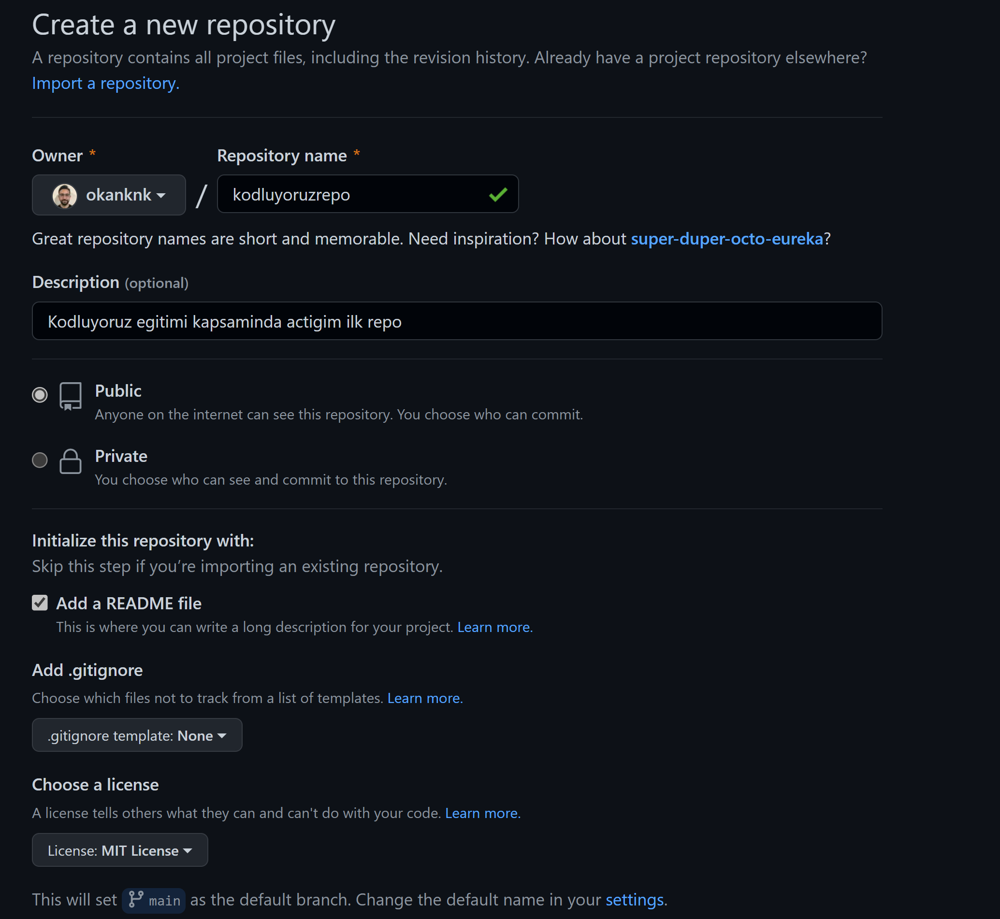

# Kodluyoruz Ilk Repo
Bu repo [Kodluyoruz](https://www.kodluyoruz.org/) ve [Patika](https://www.patika.dev/) egitiminde olusturdugumuz ilk repo. Icerisinde bir adet README dosyasi, bir adet index.html barindiriyor



## Installation

Oncelikle projeyi clonelayin. (Buraya sizin reponuzdan aldiginiz link gelecek)

```
git clone https://github.com/okanknk/kodluyoruzilkrepo.git
```

## Usage

Projeyi cloneladiktan sonra Visual Studio Code programinda aciniz

Linux icin:

```
cd kodluyoruzilkrepo\n
code .
```

## Contributing

Pull requestler kabul edilir. Buyuk degisiklikler icin, lutfen once neyi degistirmek istediginizi tartismak icin bir konu aciniz.

## License

[MIT](https://choosealicense.com/licenses/mit/)